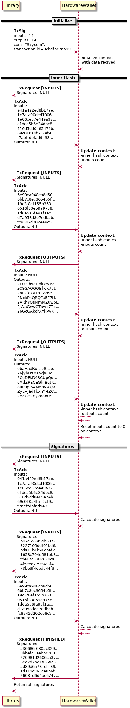

# Hardware Wallet

## Example for the signing of transactions

For signing and confirm transaction on Hardware Wallet need next:

- `skycoin-cli` command on your host
- `skycoin-hw-cli` command on your host
- conection to skycoin node for broadcast signed transaction

For this example we take a transaction with more than 8 inputs and more than 8 outputs:

Inputs hashes:
```
941a422ed8b17ae9dcbf942ace143f77c26a9c02d2e6395b46d50d1079ba4b00
1c7afa90dcd10063722c0cf8981c52bc715a6d522c4fcc92cd743e2120e866f2
1e06ce57e449a3744a58d115da99f375926b30a4aaa62500f36400c479c86026
c1dca5b6e34dbc8b8a87cae3074e1c24e555c8300043975982b3754c25fa31ef
516d5dd0465474b53520c2c7377f293823c36740b10a6cace58bcf53cabf91f2
69c010a4f512ef9a1ed73e8da5e57e7fdb11b9cadfa42babaf393c528d05b372
f7aeffdbfad94333c5198149bc1ad2a02acabeb3e67834f2f4c8aa2cac20248d
6e99ca948cb8d50dc8708d77498fccc65ca2e6e8d6192c4b178999a6ed403752
6bb7c8ec3654b5f4718988606e15947ac45fd8ac255a6838c08c926a199c412d
19c3f8ef155b363cfc9e508de5930aad477e3ffd974ac90fd53b5eb0853cf29a
0516f33e59a97587135ee4350c8edff3a196415f31e3233579c29c505d6efa2c
1d6a5a6fa9af1acf4ad8bf4348369adcaf61bab84b82697db5f733f60f91337b
d7a958d8e7edbab356b68f257e3b57d44d35e22f1fcfbee70116d502fa48e390
fc8542d202ee8c57a8f91058aaaf852a3db695248f94302f3f76f29e42d284c1
```

Outputs:
```
Output Address: 2EU3JbveHdkxW6z5tdhbbB2kRAWvXC2pLzw Coins: 2000000 Hours: 255 \
Output Address: zC8GAQGQBfwk7vtTxVoRG7iMperHNuyYPs  Coins: 2000000 Hours: 255
Output Address: 28L2fexvThTVz6e2dWUV4pSuCP8SAnCUVku Coins: 2000000 Hours: 255
Output Address: 2NckPkQRQFa5E7HtqDkZmV1TH4HCzR2N5J6 Coins: 2000000 Hours: 255
Output Address: 2ARhYQsMmMZuw5LPmZQvyWoTm1VUH8kSZ14 Coins: 2000000 Hours: 255
Output Address: FjWaGnwGTswo7TegsB9KikqcxGHy8zHTS1  Coins: 2000000 Hours: 255
Output Address: 26GcGAkdrXYkPVKkHvy5FQWAeLVVVGSmz6V Coins: 2000000 Hours: 255
Output Address: obaHadRxLaz8Laoxi8TA799ycHXNK2hgdz  Coins: 2000000 Hours: 255
Output Address: 26jybLrsXXWjwBdmR2eo4c25hYGMipLEjTr Coins: 2000000 Hours: 255
Output Address: 2CgDFkD43CUpQot3e76iuoB2BxCGXZ6xn38 Coins: 2000000 Hours: 255
Output Address: cMdZRECEGhrBqtKvuB9XW2EK9tqi4znNhN  Coins: 2000000 Hours: 255
Output Address: ouE9prS4XMhVwQa5gwW4hQuiAGamMcJmK5  Coins: 2000000 Hours: 255
Output Address: ZyLHjEdTbxnYHZC2U4ZNqSuZBUh74Sjh9v  Coins: 2000000 Hours: 255
Output Address: 2eZCcsBQVooxUStrCKEZ4TLZzbGa7tx7Cwa Coins: 2000000 Hours: 255
```

Once the hardware wallet is connected and it works correctly, using `skycoin-hw-cli` we will sign the transaction:
```
skycoin-hw-cli transactionSign \
        --inputHash 941a422ed8b17ae9dcbf942ace143f77c26a9c02d2e6395b46d50d1079ba4b00 --inputIndex 0 \
        --inputHash 1c7afa90dcd10063722c0cf8981c52bc715a6d522c4fcc92cd743e2120e866f2 --inputIndex 0 \
        --inputHash 1e06ce57e449a3744a58d115da99f375926b30a4aaa62500f36400c479c86026 --inputIndex 0 \
        --inputHash c1dca5b6e34dbc8b8a87cae3074e1c24e555c8300043975982b3754c25fa31ef --inputIndex 0 \
        --inputHash 516d5dd0465474b53520c2c7377f293823c36740b10a6cace58bcf53cabf91f2 --inputIndex 0 \
        --inputHash 69c010a4f512ef9a1ed73e8da5e57e7fdb11b9cadfa42babaf393c528d05b372 --inputIndex 0 \
        --inputHash f7aeffdbfad94333c5198149bc1ad2a02acabeb3e67834f2f4c8aa2cac20248d --inputIndex 0 \
        --inputHash 6e99ca948cb8d50dc8708d77498fccc65ca2e6e8d6192c4b178999a6ed403752 --inputIndex 0 \
        --inputHash 6bb7c8ec3654b5f4718988606e15947ac45fd8ac255a6838c08c926a199c412d --inputIndex 0 \
        --inputHash 19c3f8ef155b363cfc9e508de5930aad477e3ffd974ac90fd53b5eb0853cf29a --inputIndex 0 \
        --inputHash 0516f33e59a97587135ee4350c8edff3a196415f31e3233579c29c505d6efa2c --inputIndex 0 \
        --inputHash 1d6a5a6fa9af1acf4ad8bf4348369adcaf61bab84b82697db5f733f60f91337b --inputIndex 0 \
        --inputHash d7a958d8e7edbab356b68f257e3b57d44d35e22f1fcfbee70116d502fa48e390 --inputIndex 0 \
        --inputHash fc8542d202ee8c57a8f91058aaaf852a3db695248f94302f3f76f29e42d284c1 --inputIndex 0 \
        --outputAddress 2EU3JbveHdkxW6z5tdhbbB2kRAWvXC2pLzw --coin 2000000 --hour 255 \
        --outputAddress zC8GAQGQBfwk7vtTxVoRG7iMperHNuyYPs  --coin 2000000 --hour 255 \
        --outputAddress 28L2fexvThTVz6e2dWUV4pSuCP8SAnCUVku --coin 2000000 --hour 255 \
        --outputAddress 2NckPkQRQFa5E7HtqDkZmV1TH4HCzR2N5J6 --coin 2000000 --hour 255 \
        --outputAddress 2ARhYQsMmMZuw5LPmZQvyWoTm1VUH8kSZ14 --coin 2000000 --hour 255 \
        --outputAddress FjWaGnwGTswo7TegsB9KikqcxGHy8zHTS1  --coin 2000000 --hour 255 \
        --outputAddress 26GcGAkdrXYkPVKkHvy5FQWAeLVVVGSmz6V --coin 2000000 --hour 255 \
        --outputAddress obaHadRxLaz8Laoxi8TA799ycHXNK2hgdz  --coin 2000000 --hour 255 \
        --outputAddress 26jybLrsXXWjwBdmR2eo4c25hYGMipLEjTr --coin 2000000 --hour 255 \
        --outputAddress 2CgDFkD43CUpQot3e76iuoB2BxCGXZ6xn38 --coin 2000000 --hour 255 \
        --outputAddress cMdZRECEGhrBqtKvuB9XW2EK9tqi4znNhN  --coin 2000000 --hour 255 \
        --outputAddress ouE9prS4XMhVwQa5gwW4hQuiAGamMcJmK5  --coin 2000000 --hour 255 \
        --outputAddress ZyLHjEdTbxnYHZC2U4ZNqSuZBUh74Sjh9v  --coin 2000000 --hour 255 \
        --outputAddress 2eZCcsBQVooxUStrCKEZ4TLZzbGa7tx7Cwa --coin 2000000 --hour 255
```

This command return next signatures:

```
b42c553954b60771f4bcb4d66281fd2b4111668518fd0f57b41e51193be8bf5e7083483e529f1b0f70f749ce312430c0c775f41b49512d265d87798e7cd9186f00
3227105ddf01bd616e13daaf3e697285dd8fd56e45f1a6bb7b7675b97b6fc77d440bcbfb5b79a948039f5ba333353581fc46d30471d5e3a83e83f85aa1bb066d01
bda11b1b96cbaf2915cf6b7de691dc30fe8b1ce72cda681bcf6a8fe2d2bd19254eaec39fd5f5bf627dfd0606da82f80e2694d1032220b4bde1f2a91aba59c29a01
1658c704d581eb80820272ee5fa5e03231794095686a1cc4ca2df5bd1347a375125766390af7d50424df70180d1c24fea3eee992174ebc87220f38fa6378c4fb00
fde17c3387674ca3dd98754331408f7b8bcc9f1c69dc651e78b971e18427f39e6e25fbefa56ff2615efe35b764b618a278ed21803d71b615ff6516303d02717701
4f5cee279caa3f498c6bb7b95d5c74b740808aaee8b5dd7987db3baf57def8a97243ec55f6d5bfbd3c4a9cc03b2f7c8920d633d5df10f68d8c67f4b3fe06bf2801
73be3f4ebda44f3ec3f3ca390101508beec6474891080b0868ac5e47ccdef3b6453b20cf115c7eb6d1ae1571991dafa541f44cea1c79cc506ef0eeaff94f1a2301
a36686f630ac329b1b9a9079c034a5c32e8c666fa749b763c011f7048932487e54e5ff2b138cf7a840df22e12b5f865d3cd6c78a96690c7336566deee5d63e2101
0bb4fe114bbc760472ee897734b5f0ac566c77c5667dd1c930020b6e211801a07f8925c244cee873d7b934fb3d2bcc0514475a05ab9018afd296bf6295c2425800
220981d2606ca3775cabec8842b25a3914a4822aae3bb9bbeb5d58ea77aab8bb393eb0f91423ff12566d85acd149cefe29dd489fe0d86d2caa8be985700f3b9401
6ed7d7be1a35ac30cf8c621075236e616a9a6e9c5d45ba4f3d0616ed52c865af34e2d2fb0f97428b1e98d05cd1c1afb107d97591d36e7a45db881d919c01d41401
ad89d65781df189da1903e9f8f5988003efc7b1315b80b8efddfd60e57809f6251a4069918d409f54a28941c030e0257c841242766c2e9dcb5e1d7566f5f246901
1d119c963c40b6fbb624d7770f65b48fe8876937bea670d32ac7375ae3ebdc9839d90141b91672992d88056bc0c0002a51c3c80d42eb95be8788f1980bba402900
26081d6d4ac67479eb061a42309866b7273b395a565078f659569dfe107a29cf5fd60fe39ac368766d8e0a31bfbd3a96b8b7f7e79689dcdc962536e3de35228d00
```

Now we need build a json with next structure:

```
{
    "length": 1925,
    "type": 0,
    "txid": "cb2cab1cacf26805c2f90e387e1bbdc69cf0849c216cb593cc16231cdafafc4f",
    "inner_hash": "3f9308fd90dee27bb889e8931ef0532ebe2043a892a06288b34032200e3f7645",
    "sigs": [
	    "b42c553954b60771f4bcb4d66281fd2b4111668518fd0f57b41e51193be8bf5e7083483e529f1b0f70f749ce312430c0c775f41b49512d265d87798e7cd9186f00",
	    "3227105ddf01bd616e13daaf3e697285dd8fd56e45f1a6bb7b7675b97b6fc77d440bcbfb5b79a948039f5ba333353581fc46d30471d5e3a83e83f85aa1bb066d01",
	    "bda11b1b96cbaf2915cf6b7de691dc30fe8b1ce72cda681bcf6a8fe2d2bd19254eaec39fd5f5bf627dfd0606da82f80e2694d1032220b4bde1f2a91aba59c29a01",
	    "1658c704d581eb80820272ee5fa5e03231794095686a1cc4ca2df5bd1347a375125766390af7d50424df70180d1c24fea3eee992174ebc87220f38fa6378c4fb00",
	    "fde17c3387674ca3dd98754331408f7b8bcc9f1c69dc651e78b971e18427f39e6e25fbefa56ff2615efe35b764b618a278ed21803d71b615ff6516303d02717701",
	    "4f5cee279caa3f498c6bb7b95d5c74b740808aaee8b5dd7987db3baf57def8a97243ec55f6d5bfbd3c4a9cc03b2f7c8920d633d5df10f68d8c67f4b3fe06bf2801",
        "73be3f4ebda44f3ec3f3ca390101508beec6474891080b0868ac5e47ccdef3b6453b20cf115c7eb6d1ae1571991dafa541f44cea1c79cc506ef0eeaff94f1a2301",
        "a36686f630ac329b1b9a9079c034a5c32e8c666fa749b763c011f7048932487e54e5ff2b138cf7a840df22e12b5f865d3cd6c78a96690c7336566deee5d63e2101",
        "0bb4fe114bbc760472ee897734b5f0ac566c77c5667dd1c930020b6e211801a07f8925c244cee873d7b934fb3d2bcc0514475a05ab9018afd296bf6295c2425800",
        "220981d2606ca3775cabec8842b25a3914a4822aae3bb9bbeb5d58ea77aab8bb393eb0f91423ff12566d85acd149cefe29dd489fe0d86d2caa8be985700f3b9401",
        "6ed7d7be1a35ac30cf8c621075236e616a9a6e9c5d45ba4f3d0616ed52c865af34e2d2fb0f97428b1e98d05cd1c1afb107d97591d36e7a45db881d919c01d41401",
        "ad89d65781df189da1903e9f8f5988003efc7b1315b80b8efddfd60e57809f6251a4069918d409f54a28941c030e0257c841242766c2e9dcb5e1d7566f5f246901",
        "1d119c963c40b6fbb624d7770f65b48fe8876937bea670d32ac7375ae3ebdc9839d90141b91672992d88056bc0c0002a51c3c80d42eb95be8788f1980bba402900",
        "26081d6d4ac67479eb061a42309866b7273b395a565078f659569dfe107a29cf5fd60fe39ac368766d8e0a31bfbd3a96b8b7f7e79689dcdc962536e3de35228d00"
    ],
    "inputs": [
        "941a422ed8b17ae9dcbf942ace143f77c26a9c02d2e6395b46d50d1079ba4b00",
        "1c7afa90dcd10063722c0cf8981c52bc715a6d522c4fcc92cd743e2120e866f2",
        "1e06ce57e449a3744a58d115da99f375926b30a4aaa62500f36400c479c86026",
        "c1dca5b6e34dbc8b8a87cae3074e1c24e555c8300043975982b3754c25fa31ef",
        "516d5dd0465474b53520c2c7377f293823c36740b10a6cace58bcf53cabf91f2",
        "69c010a4f512ef9a1ed73e8da5e57e7fdb11b9cadfa42babaf393c528d05b372",
        "f7aeffdbfad94333c5198149bc1ad2a02acabeb3e67834f2f4c8aa2cac20248d",
        "6e99ca948cb8d50dc8708d77498fccc65ca2e6e8d6192c4b178999a6ed403752",
        "6bb7c8ec3654b5f4718988606e15947ac45fd8ac255a6838c08c926a199c412d",
        "19c3f8ef155b363cfc9e508de5930aad477e3ffd974ac90fd53b5eb0853cf29a",
        "0516f33e59a97587135ee4350c8edff3a196415f31e3233579c29c505d6efa2c",
        "1d6a5a6fa9af1acf4ad8bf4348369adcaf61bab84b82697db5f733f60f91337b",
        "d7a958d8e7edbab356b68f257e3b57d44d35e22f1fcfbee70116d502fa48e390",
        "fc8542d202ee8c57a8f91058aaaf852a3db695248f94302f3f76f29e42d284c1"
    ],
    "outputs": [
        {
            "uxid": "79cb2890486fffb9d1c89813d3caa596ae55b20a16e630c14b31ba9ba2193550",
            "dst": "2EU3JbveHdkxW6z5tdhbbB2kRAWvXC2pLzw",
            "coins": "2.000000",
            "hours": 149
        },
        {
            "uxid": "99cd4528433c1e5cadcbe251bc78f05a2cf5251d720c25617b8fee194c9657ec",
            "dst": "zC8GAQGQBfwk7vtTxVoRG7iMperHNuyYPs",
            "coins": "2.000000",
            "hours": 149
        },
        {
            "uxid": "f01ed2e5a6e656df417307b80c6d60c15d1c08bc3d74bf0f579dc7ab9f5f0ec0",
            "dst": "28L2fexvThTVz6e2dWUV4pSuCP8SAnCUVku",
            "coins": "2.000000",
            "hours": 149
        },
        {
            "uxid": "08cf7a4d452a9e2e9d917cdd1c4fdd4e0215330133dc1b4d8582260a84f98876",
            "dst": "2NckPkQRQFa5E7HtqDkZmV1TH4HCzR2N5J6",
            "coins": "2.000000",
            "hours": 149
        },
        {
            "uxid": "5b5934f7482c7d965e9e42f6e9ed6259100a0771b6076d6e7e7339dc75686592",
            "dst": "2ARhYQsMmMZuw5LPmZQvyWoTm1VUH8kSZ14",
            "coins": "2.000000",
            "hours": 149
        },
        {
            "uxid": "d0bda354f26561d1fa39ab2e7b4a2b45d2a4a4271cbad36eddf0c3622332de67",
            "dst": "FjWaGnwGTswo7TegsB9KikqcxGHy8zHTS1",
            "coins": "2.000000",
            "hours": 148
        },
        {
            "uxid": "3bcf795ac840166278267416e7afa25cfd760f134c42cd6ab381b50492504b78",
            "dst": "26GcGAkdrXYkPVKkHvy5FQWAeLVVVGSmz6V",
            "coins": "2.000000",
            "hours": 148
        },
        {
            "uxid": "2d303ac7de946018df903c93b81cfc2cfb479874c1568d485158878ed590a5eb",
            "dst": "obaHadRxLaz8Laoxi8TA799ycHXNK2hgdz",
            "coins": "2.000000",
            "hours": 148
        },
        {
            "uxid": "3697b69a026a0bac20b64ad4334e077618989f8cf5343abdf50022e68e7f2663",
            "dst": "26jybLrsXXWjwBdmR2eo4c25hYGMipLEjTr",
            "coins": "2.000000",
            "hours": 148
        },
        {
            "uxid": "4197eeb8e073d09788999e4d5f28d2b90ea45c48d40f267857d91edeb0fbbb31",
            "dst": "2CgDFkD43CUpQot3e76iuoB2BxCGXZ6xn38",
            "coins": "2.000000",
            "hours": 148
        },
        {
            "uxid": "78001d01e2bf251cfe9f1527a4b7999d014372d4df34f2482e66ce8287568d0e",
            "dst": "cMdZRECEGhrBqtKvuB9XW2EK9tqi4znNhN",
            "coins": "2.000000",
            "hours": 148
        },
        {
            "uxid": "e31c386af50add2f1ee2d679490e4d60ad57cbb8cc5633bbfd010d64d6babf39",
            "dst": "ouE9prS4XMhVwQa5gwW4hQuiAGamMcJmK5",
            "coins": "2.000000",
            "hours": 148
        },
        {
            "uxid": "365ed2320ee4baeef9d5e7fe31996148ea5a3ba9d2d531c6407274e822c3831f",
            "dst": "ZyLHjEdTbxnYHZC2U4ZNqSuZBUh74Sjh9v",
            "coins": "2.000000",
            "hours": 148
        },
        {
            "uxid": "44946667e62bc19959bdc05e25370a9a355739bbb3209bb5b2395f4a605fb5ed",
            "dst": "2eZCcsBQVooxUStrCKEZ4TLZzbGa7tx7Cwa",
            "coins": "2.000000",
            "hours": 148
        }
    ]
}
```

Assuming the variable `TX_JSON` is the path to the previous json file, then we call the command :
```
export TX_RAW=$(skycoin-cli encodeJsonTransaction $TX_JSON -f)
``` 

Next we need broadcast `TX_RAW`, we will do it with the fallowing command:
```
skycoin-cli broadcastTransaction $TX_RAW
```

That returns a transaction ID, with wivh can verify its status.

This whole protocol process can be represented in the fallowing diagram:


