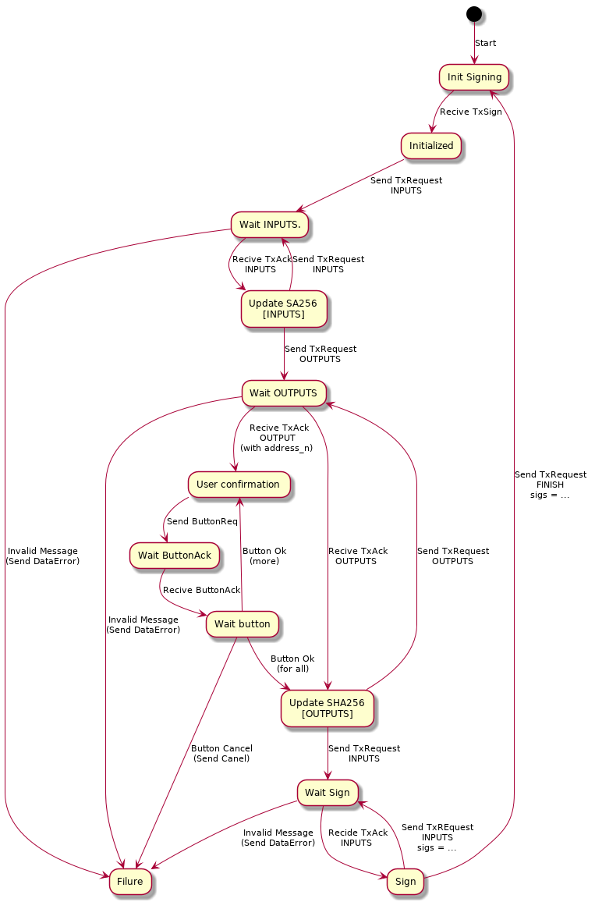

# Hardware Wallet

## Protocol for the signing of transactions

### Messages

Three different types of messages are used to implement the protocol:

- TxSig
- TxRequest
- TxAck

#### TxSign message

It is only sent by the library, never by the Hardware Wallet. Its purpose in the protocol is to inform the Hardware Wallet of the beginning of a transaction and provide information about it.

```
message SignTx {
    required uint32 outputs_count = 1;
    required uint32 inputs_count = 2;
    optional string coin_name = 3 [default='SKY'];
    optional uint32 version = 4 [default=1];
    optional uint32 lock_time = 5 [default=0];
    optional string tx_hash = 6;
}
```

- `inputs_count` and `outputs_count`: they are the total amount of inputs and outputs that make up the transaction respectively.
- `coin_name`: Contains the currency that handles the transaction.
- `version`: version of transaction.
- `lock_time`: lock time for transaction.
- `tx_hash`: hash to identify the transaction to ensure that future messages use the same hash (note that it is not a final transaction identifier).

#### TxRequest message

It is only sent by the Hardware Wallet, never by the library. In the signing process, the Hardware Wallet is the one that has the command, that is, it is the one that decides what is the next thing that is needed, the library only gives you what you ask for. `TxRequest` is the message used to ask the library for the necessary information and send the calculated signatures in response to the previous input group.

```
message TxRequest {
    required RequestType request_type = 1;
    optional TxRequestDetailsType details = 2;
    repeated TxRequestSignResponseType sign_result = 3;
    
    enum RequestType {
        TXINPUT = 0;
        TXOUTPUT = 1;
        TXMETA = 2;
        TXFINISHED = 3;
        TXEXTRADATA = 4;
    }
    
    message TxRequestDetailsType {
        optional uint32 request_index = 1;
        optional string tx_hash = 2;
    }
    
    message TxRequestSignResponseType {
        optional uint32 signature_index = 1;
        optional string signature = 2;
    }
}
```

- `request_type`: Contains the type of the order, depending on its content will be the information that the library searches within the message itself. Purpose of its possible values:
    - `TXINPUT`: Ask the library for the next set of inputs.
    - `TXOUTPUT`: Ask the library for the next set of outputs.
    - `TXMETA`:
    - `TXFINISHED`: Mark the end of the transaction signature, sending within the message the last group of signatures.
    - `TXEXTRADATA`:
- `details`: It contains two information that ensure the consistency of the protocol:
    - `request_index`: It is an integer and positive, incremental number, which ensures the sequence of the messages.
    - `tx_hash`: It contains the `tx_hash` of the` SignTx` message, to ensure that the same transaction is being discussed.
- `sign_result`: It is used only when a group of signatures is sent, the signatures it contains are those associated with the inputs of the previous message.

#### TxAck message

It is only sent by the library, never by the Hardware Wallet. Its objective is to send the Wallet Hardware the information requested in the previous `TxRequest`. Basically it is a container of inputs or outputs, you should never send both at once and it should never be empty.

```
message TxAck {
    optional TransactionType tx = 1;
    
    message TransactionType {
        optional uint32 version = 1;
        repeated TxInputType inputs = 2;
        optional uint32 lock_time = 4;
        repeated TxOutputType outputs = 5;
        optional uint32 inputs_cnt = 6;
        optional uint32 outputs_cnt = 7;
        
        message TxInputType {
            repeated uint32 address_n = 1;
            required string hashIn = 2;
        }
        
        message TxOutputType {
            required string address = 1;
            repeated uint32 address_n = 2;
            required uint64 coins = 3;
            required uint64 hours = 4;
        }
    }
}
```

- `tx`: contains the message information
    - `version`: version of the transaction, which must match the one specified in `TxSign`.
    - `inputs_cnt`: number of inputs that the message contains. The current implementation sends inputs in groups of 7 or less.
    - `inputs`: information of each of the inputs
        - `address_n`: BIP-32 path to derive the key from master node
        - `hashIn`: input hash
    - `outputs_cnt`: number of outputs that the message contains. The current implementation sends the outputs in groups of 7 or less.
    - `outputs`: information of each of the outputs
        - `address`: target coin address in Base58 encoding
        - `address_n`: BIP-32 path to derive the key from master node; has higher priority than "address"
        - `coins`: amount of transaction output
        - `hours`: accumulated hours

### Protocol operation

Below is a diagram oriented in time down, respecting the order of the actions and the end of the protocol that may exist during the same, both satisfactorily, cancellation or failure.

At all times the Hardware Wallet contains a context with the updated information on the status of the transaction being signed, keeping this status consistent and respecting the use and order of the messages is what guarantees a correct signature of the transaction.

The signing process can be divided into three ordered sections:
- Initialize
- Compute inner hash
- Compute signatures

