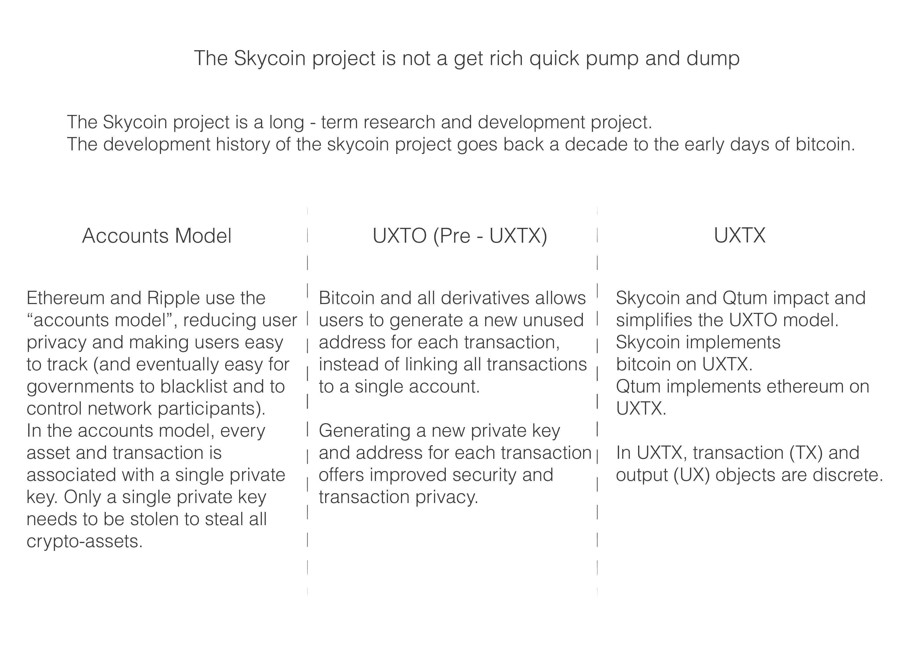

# What is a skycoin transaction?

To buy assets with skycoin or to exchange the coin by any another coin, by example exchanges Bitcoins per Skycoin, a skycoin client must create a skycoin transaction that is serialized with CXO immutable object system.

There's two questions i should answer before going forward, Why are skycoin transaction created?  and why are needed? as you may know in blockchains technologies, to transfer an ownership from owner A to owner B, a transaction should take place. A skycoin transaction is used to record a coin transfer within the blockchain, hence, users can send and receive skycoins. Only Skycoin nodes recognize and validate a skycoin transaction, if such invalid transaction is propagated over the network, a node will reject it automatically due to its invalid format or fields.

Technically speaking a transaction are data describing how to transfer coins from a party to another in a specific format broadcasted over the skycoin network. How a transaction is structured internally? The following image shows you in json format how it is structured a skycoin transaction.

What exactly are those fields within the skycoin transaction? and what are they used for?, Ok, let me explain you in the same order they appears within the above image.

The Length field, is the current transaction length.

The Type field, is the transaction type used to highlight transaction version. When a node takes a transaction, it should verify it’s type to know what should do without getting an error in the process. This was added to provide a way to update skycoin clients and servers without crashing the network.

The Txid  field or transaction id, it is a SHA256 hash and is used to reference a specific transaction within the blockchain. By example, Maria wants to know when she transfer 12 skycoins at 2016, but she does not remember at what time and date she made the transaction, but she have the transaction id, hence, she needs to find at the blockchain when she made the transaction.

The Inner Hash field, it's a SHA256 hash of inputs and outputs, it's used to protect against transaction mutability. That means that no one can modify a transaction, except that client that created the transactions.

The timestamp field, is the time when a transaction was created. Normally used by the skycoin nodes to know where a transaction should stay at a block within the blockchain.

The sigs field, it is a list of digital signatures created by a skycoin client with the private key, used by skycoins servers to verify if an owner that wants to send coins is actually the real owner. By example, let's suppose that Maria wants to send 14 Skycoins to Bob, she first need to create a transaction with it's skycoin client and send it to a skycoin server, then, the server need to check if maria's client really sent the transaction trying to verify the digital signatures with maria's public address.

Apart from that, skycoin client shall create N digital signatures per M inputs, by example, Maria current balance is [12, 12] = 24 skycoins, lets suppose Maria instead of sending 12 skycoin, she wants to send 24 skycoins, she needs to take another input of 12 skycoins that she have within her wallet, then, the transaction shall have two signatures instead of one.

The Inputs field, is a list of references of unspent transaction output, how is that? well, skycoin outputs(UX) are independent from transactions(TX) objects, simplifying the protocol and making transactions less heavy to broadcast them over the network.

Why unspent transaction outputs are references?, when a skycoin client update it’s balance, it downloads references of all outputs that are recorded somewhere in the blockchain, hence, skycoin client does not need to find all outputs data and put it back into it's transaction object as bitcoin does, actually it is not necessary, it is a waste of time and allow multiples types of attacks like the dent attack(resource exhaustion). Hence, skycoin client will choose references of outputs(UX) being spend and when the skycoin server receive the transaction will do the rest by finding those outputs(UX) by its reference in the blockchain, likewise, it will validate and record the transaction.

This transaction model is called UXTX and improve UXTO and Accounts transactions models, making it more efficient, secure and the model forms an elegant and simple directed acyclic bipartite graph.

And lastly the Outputs field, is a list of outputs created by the client, that will be recorded in the blockchain if transactions are confirmed. The outputs will be a new UXTX within the blockchain waiting to be spent by it's respective owner.

Now, let me explain you how real world works when it comes to money. Always there gonna be a guy that wants money, a lot of money in a very short time, in the cyberworld exists those guys, but behind a computer, they are called cyberterrorist, they want to steal other users money, in our case are skycoins, so, that bad people will try to apply a lot of techniques, one of them is to forward malformed transactions(fuzzing), trying to find vulnerabilities on skycoin’s miners that allows them to fake transactions or even steal skycoins. But, how exactly miners behave when incoming transactions are different as mentioned before? well, miners will act as follow, first it’ll check transaction type, if is equal to 0, the transaction shall be rejected, otherwise, miner will check if it has support for transaction's version, if it has it, then, the transaction shall be confirmed, if not, shall be rejected.