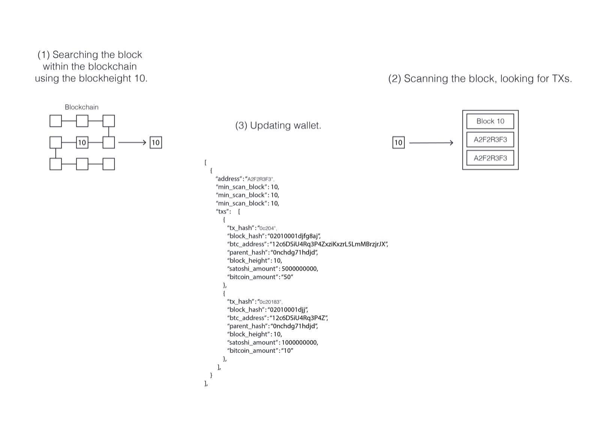

# Scanning Wallet Standard

When scanning a wallet to see how much coins it has within its balance, there exists an standard scanning technique used by wallets (cryptocurrency wallets), it's a little bit slower but it has to take place to get the final balance. As you may know a wallet is a container of addresses, to get your wallet's balance you have to find each address, one by one within the blockchain and sum the coins' amount.

Each address within the wallet has the following fields **minimun scan block**, **maximun scan block** and **middle scan block**.

**minimun scan block**: the lowest block height we have scanned for deposits to that address or the lowest block height when an address received its first deposit.

**maximun scan block**: the highest block height we have scanned for deposits to that address or the highest block height when a address received its last deposit.

**middle scan block**: used for keeping check point. It helps scan in both side simultaneously. Middle increase only if minimun reach middle.

## How it works?

This process will take 3 simple and easily to understand steps, as follow:

### **Step 1**
Scan the All blockchain by wallet to detect where deposits take place.

### **Step 2**
Each wallet's address will be iterated one by one, looking for minimun, middle and maximus block where an address received a deposit.

### **Step 3**
Take all those coins amounts and add them to the total balance.

## Scanning commands.
But there exists commands usefull to specify where to start scanning the blockchain, mostly this property is used to analyze the transactions received on some addresses. The commands already mentioned are the following **update min**, **update max**, **update short** and **update far**.

**update min**: find the lowest min across all addresses and scan 1 block forward.

**update max**: find the biggest max and scan 1 block forward.

**update short**: find address with lowest difference between mid and min, and scan 1 block forward from it's min.

**update far**: find address that min is closest to global mid and update 1 block forward.
